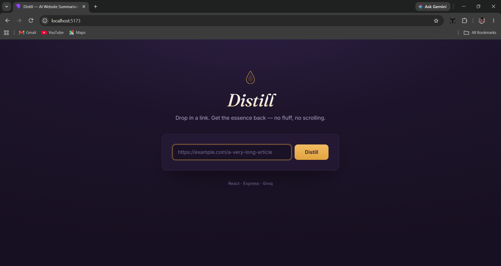

# Distill — AI Website Summariser

Paste in any public URL, and the app fetches the page's visible text and uses **Groq's
LLM API** to generate a short, readable summary — complete with a "distillation" themed
UI, loading animation, and a one-click copy button.

**Live repo:** https://github.com/DeYSayaN98/ai-website-summarizer

<!-- Demo screenshot hero banner -->
<p align="center">
  
</p>

## Folder structure

```
ai-website-summariser/
├── client/          # React app (Vite)
│   └── src/
│       ├── App.jsx      # UI: URL input, loading state, result display
│       ├── App.css
│       └── main.jsx
├── server/           # Express API
│   └── index.js       # /api/summarize — fetches page, extracts text, calls Groq
└── README.md
```


## Tech stack

- **Frontend:** React 19 + Vite, Fraunces + Inter (Google Fonts)
- **Backend:** Node.js + Express
- **Scraping:** Axios + Cheerio (fetches HTML, strips scripts/styles/nav, extracts visible text)
- **AI:** Groq API (`groq-sdk`)

A backend is required because browsers block cross-origin fetches of arbitrary websites
(CORS) and the Groq API key must never be exposed client-side.

## Setup

### 1. Get a free Groq API key
Sign up at [console.groq.com](https://console.groq.com) → API Keys → create a new key.

> **Note on models:** `llama-3.3-70b-versatile` is now Enterprise-only on Groq. This
> project defaults to `openai/gpt-oss-120b`, which is available on the free/developer
> tier. You can override it via the `GROQ_MODEL` environment variable — see below.

### 2. Backend

```bash
cd server
npm install
cp .env.example .env
# edit .env: paste your GROQ_API_KEY (and optionally set GROQ_MODEL)
npm start
```
Server runs on `http://localhost:5000`.

`.env` variables:
| Variable | Required | Default | Notes |
|---|---|---|---|
| `GROQ_API_KEY` | Yes | — | From console.groq.com |
| `GROQ_MODEL` | No | `openai/gpt-oss-120b` | Any current Groq production model, e.g. `openai/gpt-oss-20b` for faster/cheaper |
| `PORT` | No | `5000` | Backend port |

### 3. Frontend

In a new terminal:
```bash
cd client
npm install
npm run dev
```
Open the printed local URL (usually `http://localhost:5173`). Vite proxies `/api/*` calls
to the backend automatically in dev mode, so no extra config is needed locally.

For a production build:
```bash
npm run build
```
If you deploy the frontend and backend on different domains, set `VITE_API_BASE_URL` in
`client/.env` to your backend's URL (see `client/.env.example`).

## UI

- Distillation-themed design: droplet icon, deep plum/gold palette, Fraunces (serif
  headline) paired with Inter (UI text)
- Animated loading state — a small "flask" fills while the page is fetched and summarized
- Copy-to-clipboard button on the result, with inline "Copied" confirmation
- Fully responsive down to small phones; respects `prefers-reduced-motion` and has
  visible keyboard focus states

## How AI was used in this project

- A Groq-hosted model (`openai/gpt-oss-120b` by default, configurable) is called
  server-side in `server/index.js` to generate the summary from the extracted page text
  (a system prompt instructs it to produce a concise, factual 4–6 sentence summary).
- The extracted text is truncated to ~15,000 characters before being sent to the model to
  stay within context/token limits.
- Claude (Anthropic) was used as a coding assistant to scaffold this project — the React
  UI, Express API, scraping logic, and this README were generated with its help.

## API

`POST /api/summarize`
```json
{ "url": "https://example.com/article" }
```
Response:
```json
{ "title": "Page Title", "summary": "…", "sourceLength": 4213 }
```

## Notes / limitations

- Only works on publicly accessible pages that don't require login or heavy JS rendering
  (content rendered purely client-side via JS won't be captured by the basic HTML fetch).
- No database — this is stateless; each request is summarized fresh.